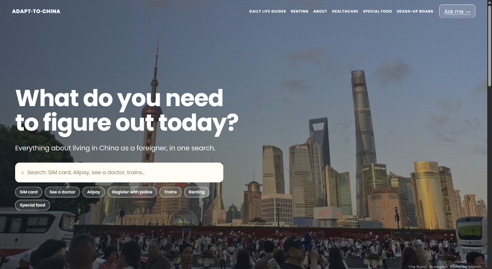
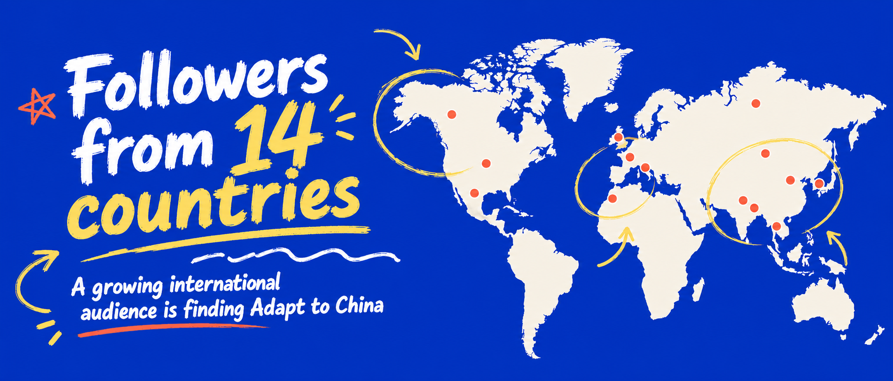
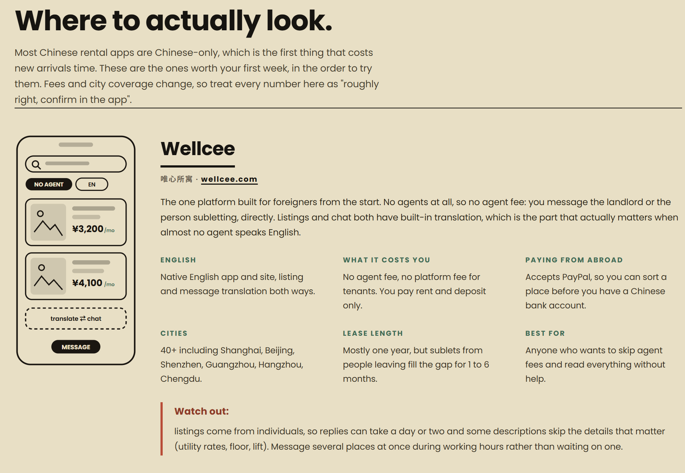

# Adapt to China

An English-first practical life platform helping international newcomers navigate everyday life in China, built and iterated with AI-assisted coding.

**Live site:** https://adapttochina.pages.dev

Adapt to China started as a collection of practical English-language guides for foreigners living in or moving to China.

It has since evolved into a small product system combining practical content, AI-assisted routing, workflow automation, structured user research, and optional human support.

---

## Product Preview

### Homepage

The homepage is designed around a simple question:

> **What's your life problem in China?**

Instead of requiring newcomers to understand the site's information architecture first, users can describe what they are trying to get done and be routed toward the most relevant next step.



---

### International Reach

Adapt to China has reached international users through English-language content, social media, community channels, and direct support requests.



---

### Practical Guides

The site turns fragmented local information into structured English-language guides for international users.

Topics include renting, healthcare navigation, payments, moving, food requirements, and common newcomer tasks.



---

## Why I Built It

Newcomers to China often face a simple problem:

The information they need usually exists somewhere, but it may be fragmented, Chinese-first, difficult to verify, or highly dependent on their individual situation.

Typical questions include:

- How do I rent an apartment?
- Can I use a foreign bank card with Alipay or WeChat Pay?
- How do I navigate a hospital visit?
- How do I communicate with a Chinese service provider?
- What should I prepare before arriving?
- When is free information enough, and when would local help save time?

Adapt to China is an attempt to reduce that friction.

The goal is not to replace local services or professional advice.

The goal is to help newcomers understand **what to do next**.

---

# AI Support Planner

The latest version of Adapt to China includes an **AI-powered Support Planner**.

Instead of searching through multiple categories, users can describe their situation in natural language.

For example:

> I need to find a room near my university in Shanghai. My budget is around RMB 3,500 and I don't speak much Chinese.

The Support Planner then:

1. interprets the user's request
2. classifies the type of need
3. generates a short structured next-step plan
4. routes the user to a relevant free Adapt to China resource when available
5. recommends optional human support only when the task genuinely requires local research, communication, or coordination

The system has been tested across scenarios including:

- housing
- healthcare navigation
- payments
- transportation
- local services
- Chinese-language phone calls and communication

---

## Example Routing

A housing request may produce:

```text
category: housing
guide_key: renting
support_key: house_finding
```

The frontend can then turn those structured fields into a user-facing result:

```text
YOUR PLAN

A clearer housing plan.

1. Confirm your preferred commute range
2. Clarify your housing requirements
3. Prepare your move-in timeline

START FREE
→ Renting in China

OPTIONAL LOCAL HELP
→ House Finding Support
```

A healthcare-navigation request may instead produce:

```text
category: healthcare
guide_key: healthcare
support_key: none
```

In that case, the product prioritizes free healthcare-navigation information rather than forcing a paid support recommendation.

---

# How the Support Planner Works

```text
User describes a problem
        ↓
Adapt to China frontend
        ↓
n8n Production Webhook
        ↓
Google Gemini
Information Extractor
        ↓
Structured JSON
        ↓
Frontend renders
a personalized plan
        ↓
Free resource
or optional local support
```

The AI returns structured data such as:

```json
{
  "category": "housing",
  "summary": "The user needs help finding suitable housing in Shanghai.",
  "urgency": "soon",
  "guide_key": "renting",
  "support_key": "house_finding",
  "next_steps": [
    "Confirm the preferred commute range.",
    "Clarify the housing requirements.",
    "Prepare the move-in date and lease length."
  ]
}
```

---

## Product Design Principle

### AI interprets. The product controls facts.

Gemini is used primarily to understand and structure user intent.

It does not control important product facts such as:

- service prices
- verified URLs
- Adapt to China guide destinations
- service scope
- verified provider information

Instead, the model returns controlled keys such as:

```text
guide_key = renting
support_key = house_finding
```

The website then maps those keys to verified resources through deterministic JavaScript logic.

This reduces the risk of the model inventing prices, URLs, services, or unsupported product information.

---

## Healthcare Boundary

For healthcare-related requests, the Support Planner acts as a **navigation tool rather than a medical advisor**.

It can help users navigate practical questions such as facility type, appointments, language accessibility, documents, payment, and relevant Adapt to China healthcare resources.

It does not attempt to diagnose conditions, prescribe treatment, or replace professional medical care.

---

# Structured User Research

Every Support Planner submission is also recorded as structured user-need data.

Instead of storing only a free-text message, the workflow records fields such as:

```text
city
timing
support_preference
original_request
category
urgency
summary
guide_key
support_key
next_steps
```

This means the Support Planner also functions as a lightweight continuous user-research system.

Over time, the data can help answer questions such as:

- Which problems do newcomers ask about most?
- Which cities generate the most requests?
- Which needs are already covered by free resources?
- Which problems repeatedly require local support?
- Which new guides or tools should be built next?

---

# Request Attribution

Every Support Planner submission receives a unique `request_id`.

Example:

```text
02873d06-e784-4e09-8108-056...
```

That same ID can follow the user's journey through later product events.

```text
Planner request
request_id = abc123
        ↓
AI recommendation
support_key = task_based_support
        ↓
User clicks the support option
        ↓
Event Tracker
request_id = abc123
event_type = support_click
```

This makes it possible to connect user intent with subsequent product behavior without relying only on a user's name or email.

---

# Conversion Event Tracking

A second n8n workflow records actions taken after a Support Planner result is shown.

When a user clicks a recommended Personal Support service, the frontend sends an event such as:

```json
{
  "request_id": "abc123",
  "event_type": "support_click",
  "category": "local_service",
  "support_key": "task_based_support",
  "city": "Shanghai",
  "source": "support-planner"
}
```

The event is stored separately from the original request.

This creates the beginning of a measurable product funnel:

```text
Planner Use
     ↓
AI Recommendation
     ↓
Support Recommended
     ↓
Support Click
     ↓
Human Conversation
     ↓
Possible Purchase
```

This structure can later support metrics such as:

```text
Planner uses
Paid-support recommendations
Unique support clicks
Recommendation → click rate
Top user-need categories
Most-clicked support services
```

---

# n8n Workflows

## 1. Support Planner

```text
Webhook
   ↓
Information Extractor + Gemini
   ├────────→ Google Sheets
   │
   └────────→ Respond to Webhook
```

Responsibilities:

- receive user input
- interpret and structure the request
- generate practical next steps
- record structured user needs
- return JSON to the frontend

## 2. Event Tracker

```text
Webhook
   ↓
Google Sheets
   ↓
Respond to Webhook
```

Responsibilities:

- receive product events
- record support clicks
- connect events with original requests through `request_id`

Keeping these responsibilities in separate workflows makes the system easier to debug and iterate.

---

# Current Product Scope

The broader Adapt to China project includes:

- 150+ practical content pages
- 130+ service and location listings
- healthcare and hospital information
- renting and moving guides
- first-arrival guidance
- halal and vegetarian food directories
- Personal Support services
- AI Support Planner
- structured user-intent logging
- conversion-event tracking

---

# Real-World Validation

Adapt to China is not only a portfolio prototype.

The project has been tested through real user conversations and real support requests.

So far, it has generated:

**6 real paid orders**

The service scope, pricing, user flows, and product positioning have been iterated based on actual user needs and feedback.

The website currently serves several roles:

```text
Information resource
        +
Trust layer
        +
User-needs intake
        +
AI routing tool
        +
Entry point to human support
```

---

# Tech Stack

### Frontend

- HTML
- CSS
- JavaScript
- JSON

### AI & Automation

- Google Gemini
- n8n
- Webhooks
- structured AI output
- JSON APIs

### Data & Analytics

- Google Sheets
- unique request IDs
- structured user-intent logging
- conversion-event tracking

### Deployment & Development

- Cloudflare Pages
- GitHub
- Git
- AI-assisted coding

---

# Development Approach

Adapt to China is developed through an AI-assisted product-building workflow:

```text
Real user problem
      ↓
User research
      ↓
Define product flow
      ↓
Build with AI coding tools
      ↓
Review and debug
      ↓
Deploy
      ↓
Observe real usage
      ↓
Collect structured data
      ↓
Iterate
```

The goal is not simply to have AI generate code.

The goal is to understand the user problem, define the system, use AI tools to accelerate implementation, debug failures, and make product decisions based on real usage.

---

# What I Learned

Some of the main lessons from building Adapt to China:

- Real user problems matter more than feature quantity.
- User research should determine what gets built next.
- AI-generated code still requires debugging and product judgment.
- Structured AI output is more useful than unrestricted text generation for many product workflows.
- AI can interpret intent while deterministic application logic controls important facts.
- Automation becomes more valuable when connected to a real user journey.
- Analytics should distinguish between what the system recommends and what the user actually does.
- Small internal tools can remove substantial repetitive operational work.
- Shipping, observing, and iterating is more useful than polishing a product in isolation.

---

# Next Steps

Current planned iterations include:

- internal analytics dashboard
- category-level demand analysis
- recommendation-to-click conversion metrics
- improved routing evaluation
- stronger integration between verified Adapt to China resources and Support Planner results
- continued testing with real newcomer scenarios

---

# Repository Notes

Public-facing directory information may be stored in this repository when it is part of the live website.

Private operating data is intentionally excluded.

This repository should not contain:

- API keys
- OAuth credentials
- passwords
- private customer conversations
- private Google Sheets data
- personally identifiable customer records

n8n credentials and private production configuration are not committed to the repository.

---

# Disclaimer

Adapt to China is an independent personal project.

Information about services, institutions, procedures, prices, and policies may change over time. Users should verify important details with the relevant official provider.

Adapt to China does not provide professional medical, legal, immigration, tax, or financial advice.

---

Built in Shanghai by **Martin Zhong**.
